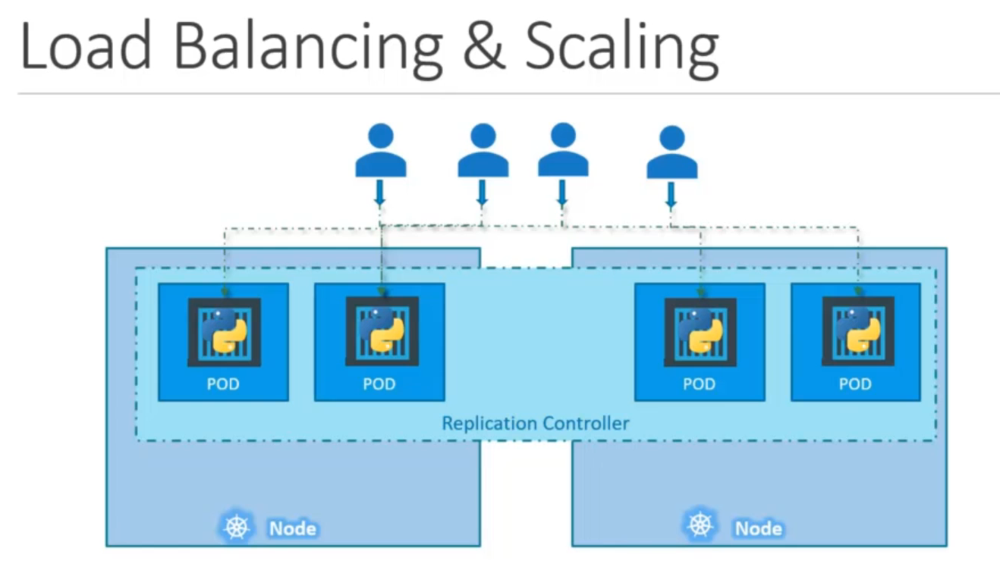
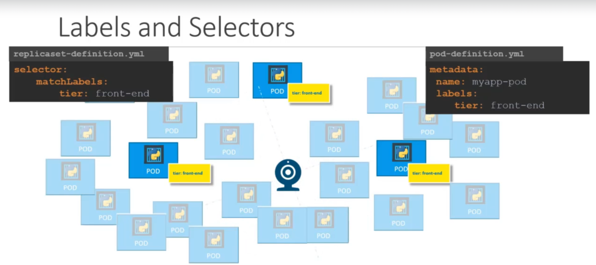

# Core Concepts

## Kubernetes Architecture

Node is a worker machine that kubernetes deploys pods/containers to

Cluster is a set of nodes grouped together

* Components of a k8s cluster
    * **API Server** - acts as front-end of a k8s cluster
    * **Controller** - brain behind orchestration (notices when nodes, containers or endpoints go down)
    * **Scheduler** - responsible for distributing work/containers across nodes
    * **etcd** - keystore stores the state of the cluster (implements logs to ensure no conflicts happen between master nodes)
    * **kubelet** - agent that runs on each node of the cluster (makes sure the containers are running on the cluster as expected)
    * **Container Runtime** - underlying container runtime

* Master vs. Worker Nodes

    * The master has the Kube-APIserver and that's what makes it the master
    * Also it has etcd, controller, and scheduler on it
    * The worker nodes have kubelet installed on them

* `kubectl` tool is used to deploy and manage cluster
    * `kubectl run hello-minikube` - deploys app to the cluster
    * `kubectl cluster-info` - used to view info about the cluster
    * `kubectl get nodes` - used to list all nodes part of the cluster

## Docker vs. ContainerD

There are differences

cli tools: ctr, nerdctl, crictl

In the beginning, there was just Docker (it became dominant because easy for users). Kubernetes was developed to orchestrate the Docker containers. However, k8s became popular and other container solutions (like rkt) wanted in. So k8s created the CRI (container-runtime-interface) allowed any vendor to plug into their solution **as long as they adhered to the OCI standard (open container initiative).**

### OCI (Open Container Initiative) Standard

There are 2 parts the standard

1. imagespec - specifications on how an image to be built
1. runtimespec - specifies how the container runtime should be developed

Docker didn't adhere to the OCI standard because it was built wayyyy before all the others. So dockershim was created so k8s could still support docker. it was a hacky solution.

Docker comes with its own tools, like the CLI, API, BUILD, VOLUMES, AUTH, and SECURITY, all separate from containerd. Containerd can be used as a runtime on its own, separate from docker.

Kubernetes 1.24 removed dockershim completely.

## Containerd

Containerd is a graduated project and is now part of the [CNCF](https://www.cncf.io/). You could install containerd without docker itself. So without the `docker run` command, how do you spin up containers?

### ctr

Containerd comes with a tool called `ctr` which is solely made for debugging containerd. `nerdctl` is the tool that provides a stable and human-friendly user experience. BUT you can still use ctr to do stuff

#### Sample commands

* `ctr`
* `ctr images pull docker.io/library/redis:alpine`
* `ctr run docker.io/library/redis:alpine redis`

These commands above all still work. Not to be used in production settings.

### nerdctl

* `nerdctl` provides a Docker-like CLI for containerD
* `nerdctl` supports docker compose
* `nerdctl` supports newest features in containerD
    * Encrypted container images
    * Lazy Pulling
    * P2P image distribution
    * Image signing and verifying
    * Namespaces in k8s

#### Sample commands

| docker      | nerdctl |
| ----------- | ----------- |
| `docker`    | `nerdctl`   |
| `docker run --name redis redis:apline`   | `nerdctl run --name redis redis:apline` |
| `docker run --name webserver -p 80:80 -d nginx` | `nerdctl run --name webserver -p 80:80 -d nginx` |

### crictl

* `crictl` - Container runtime interface control provides a CLI for CRI compatible continer runtimes
* Installed separately
* Used to inspect and debug container runtimes
    * Not to create containers ideally
* Works across different runtimes

`ctr` and `nerdctl` were developed/maintained by containerD community, while `crictl` is maintained by the k8s community. It works for every container runtimes

Kind of works along with kubelet. If you create stuff with `crictl`, then kubelet may delete the pod because it doesn't know about that.

#### Sample commands

* `crictl ps -a` - lists containers that are running
* `crictl exec -i -t 12jh5k2j3453jh5k4 ls`
* `crictl logs 35543h53j5kkj098uik`
* `crictl pods` - CRICTL IS AWARE OF K8S PODS. Docker cannot do this command


## Recap of Pods

`kubectl` is how to deploy pods. Creates a pod and launches a container in it

`kubectl run nginx --image nginx`

## Yaml in K8s

All k8s yaml files have 4 basic sections.

```yaml
--- # the three dashes define a new document
apiVersion: v1
kind: Pod
metadata:
  name: myapp-pod
  labels:
    app: myapp
    type: front-end
spec:
  # Where we provide info about what the definition file
  containers:
    - name: nginx-container # the - indicates this is a list
      image: nginx
```

`kubectl get pods` - gets a list of pods

`kubectl describe pod podname` - describes a pod, such as events and stuff

# Create and Configure Pods

## Replication Controller (Old)

Used to create multiple pods to distribute load across them.



## Replicaset (New and used)

The replicaset has a selector key. Selector section specifies what pods the replicaset manages.

The replicaset can manage pods that were not part of the deployment of the replicaset. So it will take into consideration the pods that are already present when the replicaset is created.


