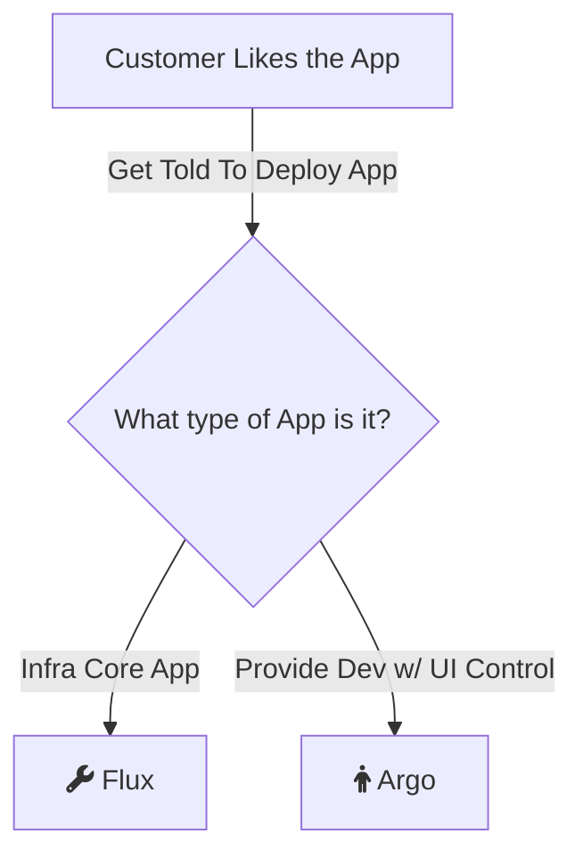

# K8s Notes

# 2025-08-24

[Ingress refresh](https://kubernetes.io/docs/concepts/services-networking/ingress/?ref=toolchain-labs-engineering-blog)

[cluster DNS troubleshooting](https://kubernetes.io/docs/tasks/administer-cluster/dns-debugging-resolution/)

# 2025-10-13

Planning for KubeCon 2025

New tools to look into

[Kanvas](https://kanvas.new/extension/meshmap)


# 2025-09-29

[kubectl klock](https://github.com/applejag/kubectl-klock) - A kubectl plugin to render the kubectl get pods --watch output in a much more readable fashion.

# 2025-08-02

https://devopscube.com/kubernetes-architecture-explained/

CCM - Cloud controller manager - When kubernetes is deployed in cloud environments, the cloud controller manager acts as a bridge between Cloud Platform APIs and the Kubernetes cluster.

This way the core kubernetes core components can work independently and allow the cloud providers to integrate with kubernetes using plugins. (For example, an interface between kubernetes cluster and AWS cloud API)

Cloud controller integration allows Kubernetes cluster to provision cloud resources like instances (for nodes), Load Balancers (for services), and Storage Volumes (for persistent volumes).

This is the basis for multi-cloud architectures. As long as this exists, this forces cloud providers to think about and pay people to integrate with kubernetes.

# 2025-07-27

[Kubernetes 1.33 that offers a new approach to registries](https://cloudsmith.com/blog/goodbye-image-pull-secrets-hello-kubernetes-credential-providers)

```yaml
apiVersion: v1
kind: Pod
metadata:
  name: app-with-sidecar
spec:
  initContainers:
  - name: sidecar-proxy
    image: envoy:latest
    restartPolicy: Always  # This makes it a sidecar!
    # Sidecar starts first, stays running, stops last
  containers:
  - name: main-app
    image: my-app:latest
    # Main app starts after sidecar is ready
```

# 2025-07-13

[Current DevSecOps factories](https://www.carahsoft.com/devsecops-buyers-guide?subtopic=Development+Tools#technology-providers)

# 2025-06-29

Alot happened. I'll track what I've been using here soon.

https://github.com/Azure-Samples/aks-store-demo I like the store demo to get an example up and running quickly

Interesting find with GPU enabled VMs https://learn.microsoft.com/en-us/azure/aks/ai-toolchain-operator#prerequisites

### GitOps

[Best thing I've read regarding the 2.](https://northflank.com/blog/flux-vs-argo-cd)


#### ArgocCD

If you’re optimizing for developer experience and want a centralized UI to manage app deployments across clusters, Argo CD is a reliable choice. It gives you visibility and controls that dev teams appreciate out of the box.

#### FluxCD

If you’re building internal platforms or managing infrastructure as code at scale, Flux gives you more control. It fits right into Kubernetes with native CRDs and lets you compose complex setups without extra tooling.

You don’t need to pick one forever. Some teams even use both: Flux for infra, Argo CD for apps



https://handbook.gitlab.com/handbook/tools-and-tips/#using-mermaid

https://www.mermaidchart.com/app/projects

# 2025-06-03

https://devopscube.com/kubernetes-ingress-tutorial/

# 2025-05-31

Single binary k8s dashboard

```sh
https://github.com/kubewall/kubewall
```

# 2025-05-30

```
https://headlamp.dev/
https://github.com/GoogleCloudPlatform/khi
https://medium.com/@gharbisofiene98/automating-secure-secrets-management-in-aks-with-terraform-and-azure-key-vault-e6a71f5f6805
https://github.com/philippemerle/KubeDiagrams
https://github.com/mkimuram/k8sviz
https://mogenius.com/blog-posts/securing-applications-using-keycloaks-helm-chart
https://github.com/cerbos/cerbos
https://github.com/jkroepke/helm-secrets
https://github.com/ChristofferNissen/helmper
https://blog.mohsen.co/etcd-production-setup-with-openssl-2b9ecd7e00d5
https://itnext.io/distroless-images-in-docker-minimalism-security-and-debugging-in-kubernetes-339a9b4421fa
https://medium.com/@gharbisofiene98/automating-secure-secrets-management-in-aks-with-terraform-and-azure-key-vault-e6a71f5f6805
```

# 2025-05-21

https://github.com/yonahd/kubernetes-access-manager 

# 2025-05-20

https://www.vcluster.com/docs/vcluster

Quick start vcluster

```sh
curl -L -o vcluster "https://github.com/loft-sh/vcluster/releases/download/v0.25.0/vcluster-linux-amd64" && sudo install -c -m 0755 vcluster /usr/local/bin && rm -f vcluster
vcluster create demoxvcluster --namespace team-x
vcluster disconnect
vcluster create demoyvcluster --namespace team-y
vcluster disconnect
vcluster create demozvcluster --namespace team-z

kubectl create namespace z-nginx
kubectl create deployment zzz-nginx -n z-nginx --image=nginx -r 2
k expose deploy -n z-nginx zzz-nginx --name z-ng-svc --port=8888 --target-port=80
k get svc -n z-nginx
k port-forward -n z-nginx --address=0.0.0.0 svc/z-ng-svc 8080:8888
cat /etc/killercoda/host
```

# 2025-05-17

https://docs.gitlab.com/runner/install/kubernetes/

```sh
helm repo add gitlab https://charts.gitlab.io
helm search repo -l gitlab/gitlab-runner
helm pull gitlab/gitlab-runner --version 0.75.1
docker save <image> -o <tarname> # save 
```

# 2025-05-15

PostgreSQL operator + ui

https://github.com/zalando/postgres-operator/blob/master/docs/quickstart.md#deployment-options

https://github.com/kubernetes-sigs/kustomize/tree/master/examples

## Local install of app

https://github.com/salaboy/platforms-on-k8s/blob/main/chapter-2/README.md

# 2025-05-11

Pipeline integrations

https://www.blackduck.com/integrations.html

https://spacelift.io/blog/ci-cd-pipeline

https://spacelift.io/blog/what-is-checkov


https://k8sgpt.ai/#providers

https://devoriales.com/post/349/how-to-install-argocd-with-helm-on-local-dev-cluster

# 2025-05-10

Run debug pod and then remove it when done

```sh
kubectl run NAMEOFPOD -n NAMESPACE --rm --tty -i --restart='Never' --image docker.io/bitnami/postgresql:17.2.0-debian-12-r6 --env="PGPASSWORD=bobjoe" --command -- sh
```

# 2025-05-03

https://playground.kyverno.io/#/

https://github.com/kubernetes/examples/blob/master/guestbook/all-in-one/guestbook-all-in-one.yaml

https://kubernetes.io/docs/tasks/administer-cluster/dns-debugging-resolution/

# 2025-05-02

https://github.com/flyteorg/flyte

Favorite [krew plugins](https://krew.sigs.k8s.io/plugins/) currently:

```sh
access_matrix
ctx
explore
images
krew
kubescape
minio
ns
pv_migrate
resource_capacity
retina
```

# 2025-04-27

```sh
# ; echo <---- at the end makes it easier to see output
k get secret -n argocd argocd-initial-admin-secret -o jsonpath='{.data.password}' | base64 -d ; echo
```

## What I did in boating school

All the stuff I did to go from 0 to solar system app on my local machine

### Get helm

https://helm.sh/docs/intro/install/#from-script

### Get terraform

https://developer.hashicorp.com/terraform/install#linux

### Create useful local directories

```sh
mkdir -p ~/.local/bin
mkdir -p ~/.secrets # source files in here when ready
```

### Add this to .bashrc

```sh
if test -d "~/.local/bin"; then
  PATH="$PATH:~/.local/bin"
fi

# K8s config
source <(kubectl completion bash)

alias k=kubectl
complete -o default -F __start_kubectl k

terraform -install-autocomplete
```

### Github resources

https://github.com/search?q=https%3A%2F%2Fargoproj.github.io%2Fargo-helm+language%3AHCL&type=code&l=HCL

https://github.com/remikeat/cluster/blob/3754e93b7d242ab384dac68e4206565e8ed9d6a5/terraform/charts.tf#L32

https://github.com/jeromedecoster/argocd-sync-wave-postgres

https://repo.broadcom.com/bitnami-files/index.yaml


# 2025-04-25

https://github.com/wolfi-dev/os

# 2025-04-22

Worked with AKS today.

Deploying a cluster on AKS failed multiple times because of the subscription. It's definitely better to deploy with code rather than going through the UI on this.

K8s bibile has [this advanced section working with AKS](https://github.com/PacktPublishing/The-Kubernetes-Bible-Second-Edition/tree/main/Chapter21)

https://learn.microsoft.com/en-us/azure/aks/azure-cni-powered-by-cilium - Azure cni is cilium under the hood

https://learn.microsoft.com/en-us/azure/application-gateway/tutorial-ingress-controller-add-on-existing

```sh
az aks create -n myCluster -g myResourceGroup --network-plugin azure --enable-managed-identity -a ingress-appgw --appgw-name myApplicationGateway --appgw-subnet-cidr "10.225.0.0/16" --generate-ssh-keys --node-vm-size Standard_D2ads_v6 --node-count 2
```

### Connect to single node on AKS

Prereqs: Install `az` cli and `kubectl`

```sh
# open terminal
az login
# Set the cluster subscription
az account set --subscription 8bd265d3-60d5-42f2-a25d-eca3af276dba
# Download cluster credentials
az aks get-credentials --resource-group republiccity_group --name republiccity --overwrite-existing
# Create debugger pod
kubectl debug node/aks-agentpool-38679704-vmss000001 -it --image=mcr.microsoft.com/cbl-mariner/busybox:2.0
# Start kubectl session
chroot /host
```

### Get admin config file

```sh
az aks get-credentials --resource-group myResourceGroup --name myCluster --file az-admin-kubeconfig
```

# 2025-04-18

Killercoda - Expose a svc to be accessed from a browser

```sh
cat /etc/killerkoda/host # get the url
kubectl port-forward --namespace <somens> svc/<somesvc> 8080:80 --address 0.0.0.0
```

**`kubeapps.yaml`**
```yaml
apiVersion: v1
kind: Secret
metadata:
  name: kubeapps-operator-token
  namespace: default
  annotations:
    kubernetes.io/service-account.name: example
type: kubernetes.io/service-account-token

# helm repo add bitnami https://charts.bitnami.com/bitnami
# helm install my-kubeapps bitnami/kubeapps --version 17.1.4 -n kubeapps --create-namespace
# kubectl port-forward --namespace kubeapps service/my-kubeapps 8080:80 --address 0.0.0.0
# cat /etc/killercoda/host
# kubectl create serviceaccount example
# k create clusterrolebinding --clusterrole=cluster-admin --serviceaccount=example
# k apply -f kubeapps-secret.yaml
```

# 2025-04-22

Worked with AKS today.

Deploying a cluster on AKS failed multiple times because of the subscription. It's definitely better to deploy with code rather than going through the UI on this.

K8s bibile has [this advanced section working with AKS](https://github.com/PacktPublishing/The-Kubernetes-Bible-Second-Edition/tree/main/Chapter21)

[When to choose which networking solution on ASK](https://learn.microsoft.com/en-us/azure/aks/azure-cni-overlay?tabs=kubectl#choosing-a-network-model-to-use)

# 2025-04-02

[Excellent resource for deploying rke2](https://docs.expertflow.com/cx/4.8/rke2-deployment-in-high-availability-with-nginx-ha)

[Convert docker compose files to k8s manifests](https://kompose.io/)

[Ai may take my job?](https://k8sgpt.ai/blog/)

# 2025-04-01

https://direnv.net/ - environment variables per directory

https://image-builder.sigs.k8s.io/introduction.html - image builder

# 2025-03-31

GitOps for Kubernetes by Micheal Levan on O'Reilly

Code examples: https://github.com/AdminTurnedDevOps/PearsonCourses/tree/main/GitOps-For-Kubernetes

### ArgoCD

ArgoCD was developed by Intuit (Yes, the financial platform)

ArgoCD comes with monitoring/logging. Easy to setup. Easy to deploy.

Monitoring = Seeing the data

Oberservability = Doing something with the data. Taking logs, metrics and stuff and then DO something with it (create alert)

https://argo-cd.readthedocs.io/en/stable/operator-manual/metrics/ all metrics provided by argocd

### RKE2 w/ CAPI

https://caprke2.docs.rancher.com/00_introduction.html


### Gitlab stuff

https://gitlab-com.gitlab.io/cs-tools/gitlab-cs-tools/what-is-new-since/?tab=features&minVersion=15_11&selectedMinTier=ultimate&selectedMaxTier=ultimate

https://gitlab.com/gitlab-com/runbooks

https://handbook.gitlab.com/handbook/engineering/infrastructure/incident-management/ : How to do incident management

https://docs.gitlab.com/administration/gitaly/kubernetes/

https://gitlab.com/gitlab-org/gitlab-environment-toolkit


# 2025-03-28

Deployed rancher cluster to AWS. Configured security rules. Deployed nginx deployment.

https://github.com/clemenko/rke_install_blog?tab=readme-ov-file#rke2-install THE GOOOOOOOOAT

* K8s dashboard

https://upcloud.com/resources/tutorials/deploy-kubernetes-dashboard

* Nginx Ingress controller

https://kubernetes.github.io/ingress-nginx/deploy/baremetal/

Bare metal needs [metallb](https://metallb.io/)

# 2025-03-27

K8s engineer --> Cade G Thomas interview notes:

* https://docs.rke2.io/install/ha

Yeah you will just need to add the SANs as well for the VIP DNS name if you want an extra name like k8s.domain.com

```sh
# Debug container on node
k debug node/some-node -it --image=docker.io/redhat/ubi/ubi8:8.3 -sh
```

# 2025-03-25

https://github.com/anchore/syft

Run the following after syft is installed to generate sboms for each container image:

Example:

```bash
images=$(helm template percona/pxc-db | grep image: | sed -e 's/[ ]*image:[ ]*//' -e 's/"//g' | sort -u)
for image in $images; do mkdir -p "${image//:*/}" && syft $image -o syft-text > "${image//:*/}/sbom.txt"; done
```

Text file will be produced which contains all running images


## Delete leftover CRDs

```bash
kubectl get crd -oname | grep --color=never 'istio.io' | xargs kubectl delete
```


# 2025-03-23

## DOD Sites and STIG Guide

https://dl.dod.cyber.mil/wp-content/uploads/stigs/zip/U_Kubernetes_V1R11_STIG.zip

https://dl.dod.cyber.mil/wp-content/uploads/stigs/zip/U_Kubernetes_V1R3_STIG_SCAP_1-2_Benchmark.zip

STIGs Document Library – DoD Cyber Exchange

https://dl.dod.cyber.mil/wp-content/uploads/stigs/zip/scc-5.8_rhel8_oracle-linux8_x86_64_bundle.zip

https://dl.dod.cyber.mil/wp-content/uploads/stigs/zip/scc-5.8_Windows_bundle.zip

# 2025-03-23

OIDC login for kubectl commands https://github.com/int128/kubelogin 

# 2025-03-22

[Kubernetes Bible: Second Edition](https://github.com/packtpublishing/the-kubernetes-bible-second-edition) with [images](https://static.packt-cdn.com/downloads/9781835464717_ColorImages.pdf) 

# 2025-03-10

https://docs.aws.amazon.com/eks/latest/userguide/auto-elb-example.html

https://docs.aws.amazon.com/eks/latest/userguide/aws-load-balancer-controller.html

# 2025-03-07

Layers of the k8s cluster

### Base layers

1. OS
2. Kubernetes
3. Networking plugin (cilium becoming the best, calico is ok, weavenet)
4. Storage (some csi driver)

### App layers


# 2025-02-28

AWS Example k8s app architecture

https://github.com/aws-containers/retail-store-sample-app

https://aws.amazon.com/blogs/opensource/using-istio-traffic-management-to-enhance-user-experience/

# 2025-02-19

Killercoda updated the way you expose apps to the internet

```bash
kubectl port-forward service/frontend 8080:80 --address 0.0.0.0
```

Have to add the address flag to specify the interface to be used


## 2024-12-09

```bash
# Create an ssl secret
k create secret tls <secret name> \
 -n <namespace> \
 --cert=<certificate name>.crt --key=<certificate key>.key \
 --dry-run=client -o <secret name>.yaml
```

## 2024-11-10

https://collabnix.com/kubernetes-on-docker-desktop-in-2-minutes/

https://medium.com/google-cloud/kubernetes-nodeport-vs-loadbalancer-vs-ingress-when-should-i-use-what-922f010849e0

https://mattsegal.dev/nginx-django-reverse-proxy-config.html

## 2024-09-30

Get images from all pods running

```bash
kubectl get pods -n <NAMESPACE> -o yaml | grep image: | sed -r 's/^.*image: (.+)/\1/' | sort | uniq
```

## 2024-09-14

Read a couple papers today

### Helm

https://arxiv.org/pdf/2206.07093

Deploying apps to kubernetes requires sending manifest files to the control plane interface.

https://docs.teamhephy.info/ Created by Deis and graduated from the CNCF

### Deploy microservices with docker, k8s, and istio

https://arxiv.org/pdf/1911.02275

On-prem vs. Cloud hosted apps.
* Up-front costs are removed by using cloud hosted apps
* On-prem deployments require security and network engineers
* As usage grows the costs increase exponentially. Snapchat pays google 2B and amazon 1B as of 2018

Triphasic incremental approach

1. Separation
2. Transition - Something that istio can help with using canary deployments and traffic balancing. Need cooperation between development teams and operation team
4. Completion

## 2024-09-12

Common misconfigs of K8s - https://arxiv.org/pdf/2408.03714

Kubernetes Deployment Options for On-Prem Clusters --- https://arxiv.org/pdf/2407.01620

Disaster recovery - https://arxiv.org/pdf/2402.02938

Gap between School and Software Jobs - https://arxiv.org/pdf/2303.15597

Helm - https://arxiv.org/pdf/2206.07093

Deploy microservices with docker, k8s, and istio - https://arxiv.org/pdf/1911.02275

## Earlier than Sept 2024

Prod cluster app installs

1. Flux - provides kustomizations and
2. Metallb

https://metallb.universe.tf/installation/
https://metallb.universe.tf/configuration/

# Deployed a django app in k8s cluster w/ nginx & postgres

https://collabnix.com/kubernetes-on-docker-desktop-in-2-minutes/
https://medium.com/google-cloud/kubernetes-nodeport-vs-loadbalancer-vs-ingress-when-should-i-use-what-922f010849e0
https://mattsegal.dev/nginx-django-reverse-proxy-config.html

Amazing resources. Explains django reverse proxy and a great utility that visualizes k8s resources

# Kubernetes the hard way

https://github.com/kelseyhightower/kubernetes-the-hard-way/tree/master

https://www.youtube.com/watch?v=Z-Pxl84WNGo

# Debugging tips

`journalctl -u containerd -e`

-u - unit
-e - jump to end of journal

# Output with kubectl

https://kubernetes.io/docs/reference/kubectl/cheatsheet/ great resource

`master $ kubectl create namespace test-123 --dry-run -o yaml`

will yield

```yaml
apiVersion: v1
kind: Namespace
metadata:
  creationTimestamp: null
  name: test-123
spec: {}
status: {}

```

`kubectl run nginx --image=nginx --dry-run=client -o yaml > nginx-pod.yaml`

will yyield

# Services

The way Kubernetes allows applications to be exposed to outside users

## Nodeport

All terminology is from the perspective of the Service

The Nodeport service is called as such because it listens to a port on the node and forwards that request to a pod within the cluster

Valid node ports are from 30,000-32,767

https://www.bogotobogo.com/DevOps/Docker/Docker_Kubernetes_Service_IP_and_Service_Type.php

```bash
kubectl create deployment hello-node --image=k8s.gcr.io/echoserver:1.4

kubectl expose deployment < NAME-OF-DEPLOYMENT > --name=FirstNodeportSvc --port=80 --target-port=8080 --type=NodePort

kubectl port-forward --address 0.0.0.0 svc/FirstNodeportSvc 31213:80 &
```

Explanation

1. `kubectl port-forward`: This is a kubectl command used to forward one or more local ports to a pod. It's useful for accessing applications in a Kubernetes cluster from your local machine.

1. `--address 0.0.0.0`: By default, port-forward binds only to 127.0.0.1, which means it can only be accessed from the local machine. The --address 0.0.0.0 flag changes this behavior to bind to all network interfaces. This makes the forwarded port accessible from external machines. However, be cautious when using this, as it exposes the port to the entire network.

1. `svc/hello-minikube`: This specifies the target for port forwarding. In this case, it's a service named hello-minikube. Typically, port-forward is used with pods, but it can also be used with services, deployments, and replicasets.

1. `31183:8080`: This defines the port mapping:

* `31183`: This is the local port on your machine.
* `8080`: This is the port on the hello-minikube service in the Kubernetes cluster.

    With this mapping, any traffic sent to port 31183 on your local machine will be forwarded to port 8080 on the hello-minikube service in the cluster.

1. `&`: This is a shell command to run the kubectl port-forward command in the background. This allows you to continue using the terminal without waiting for the command to complete.

In summary, this command forwards traffic from port 31183 on all network interfaces of your local machine to port 8080 on the hello-minikube service in the Kubernetes cluster

# Deploying a django app to a k8s cluster

https://mattermost.com/blog/orchestrate-django-application-with-kubernetes/
